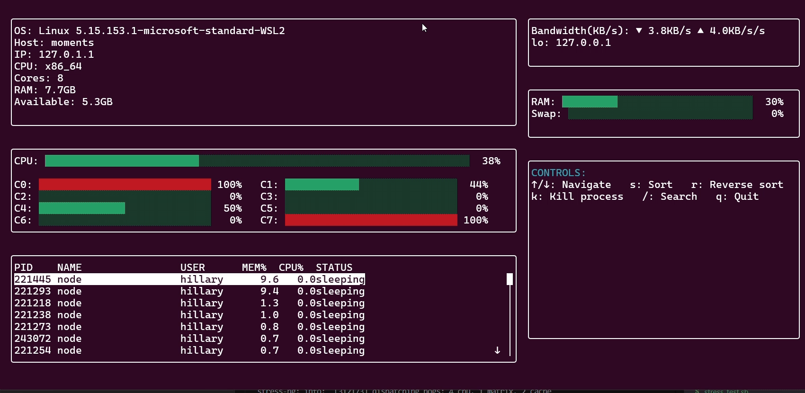

# Python System Monitor

A high-performance, real-time system monitoring tool with an interactive terminal user interface. Monitor CPU, memory, network, processes, and system information with smooth updates and responsive controls.



## Features

- 🚀 Real-time system metrics monitoring
- 💻 Per-core CPU usage and temperature tracking
- 🧮 Memory and swap usage visualization
- 🌐 Network bandwidth monitoring with rate smoothing
- 📊 Process management with detailed statistics
- ⚡ Asynchronous architecture for optimal performance
- 🎯 Interactive process control (kill, sort)
- 📱 Responsive terminal UI with automatic resizing

## Requirements

- Python 3.12+
- Linux/Unix-based system

Required packages:
- psutil>=5.9.0
- aiofiles>=24.1.0

## Installation

1. Clone the repository:
```bash
git clone https://github.com/Hillary520/python_system_monitor.git
cd python_system_monitor
```

2. Create a virtual environment (optional but recommended):
```bash
python -m venv venv
source venv/bin/activate  # On Windows: venv\Scripts\activate
```

3. Install dependencies:
```bash
pip install -r requirements.txt
```

## Usage

Run the monitor:

```bash
python3 run_monitor.py
```

### Controls

- `↑`/`↓`: Navigate process list
- `k`: Kill selected process
- `q`: Quit
- `r`: Refresh display
- `F5`: Force refresh

## Stress Testing

The project includes a stress test script to verify monitoring capabilities:
```bash
chmod +x stress_test.sh
./stress_test.sh
```

## Architecture

- **Async Core**: Built on Python's asyncio for non-blocking operations
- **Modular Design**: Separate monitors for different system aspects
- **Optimized Updates**: Variable refresh rates per component
- **Resource Efficient**: Minimal CPU/Memory footprint

## Project Structure

```
python_system_monitor/
├── src/
│   └── python_system_monitor/
│       ├── monitors/
│       │   ├── cpu_monitor.py
│       │   ├── memory_monitor.py
│       │   ├── network_monitor.py
│       │   ├── process_monitor.py
│       │   └── system_info.py
│       ├── ui/
│       │   └── ui_handler.py
│       └── main.py
├── stress_test.sh
├── run_monitor.py
├── requirements.txt
└── README.md
```

## Development

To run tests:
```bash
pytest tests/ --cov=python_system_monitor
```

## Acknowledgments

- Built with [psutil](https://github.com/giampaolo/psutil)
- Inspired by tools like [htop](https://github.com/htop-dev/htop), [glances](https://github.com/nicolargo/glances) and [bpytop](https://github.com/aristocratos/bpytop)

## About

This project was created to provide a modern, efficient system monitoring solution with a focus on performance and user experience.
```
